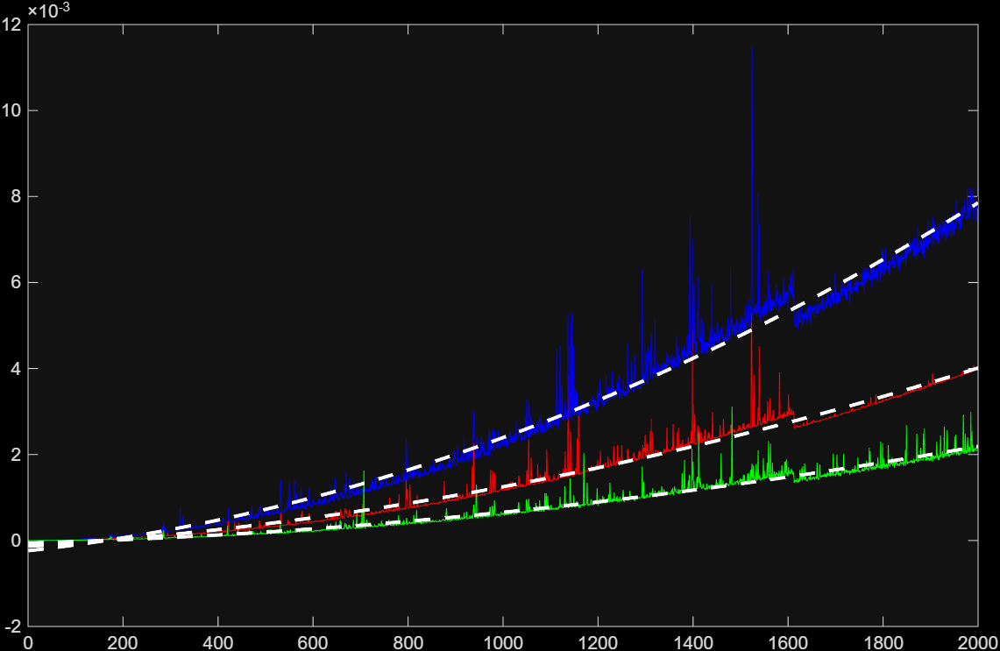
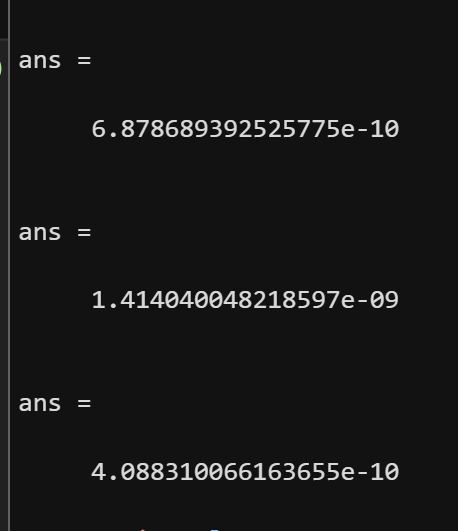

# Risultati misurazioni
Come previsto gli algoritmi di sorting hanno performato secondo O(n^2)

*in blu il selection, in rosso il bubble, in verde il insertion*

*in figura il coefficente a della polifit grado 2 sui dati nel medesimo ordine.*
