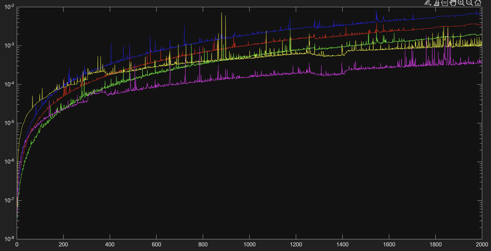
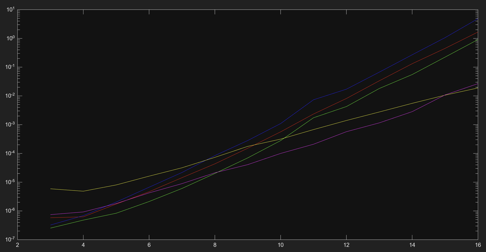

# Risultati misurazioni
I nuovi algoritmi di sorting performano O(n log n)
in blu il selection, in rosso il bubble, in verde il insertion, in giallo il merge e in rosa il quick
Dai risultati sotto ai 170 gli algoritmi bubble, insertion e selection performano meglio del merge e del quick

*Plot con passo 1 fino a 2000 elementi*

*plot con passo 2^n^ fino a 2^16^ elementi*
